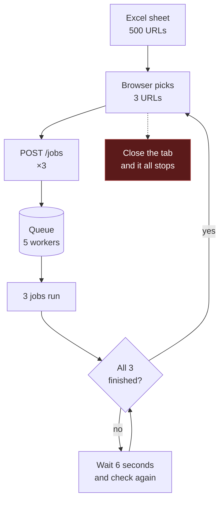
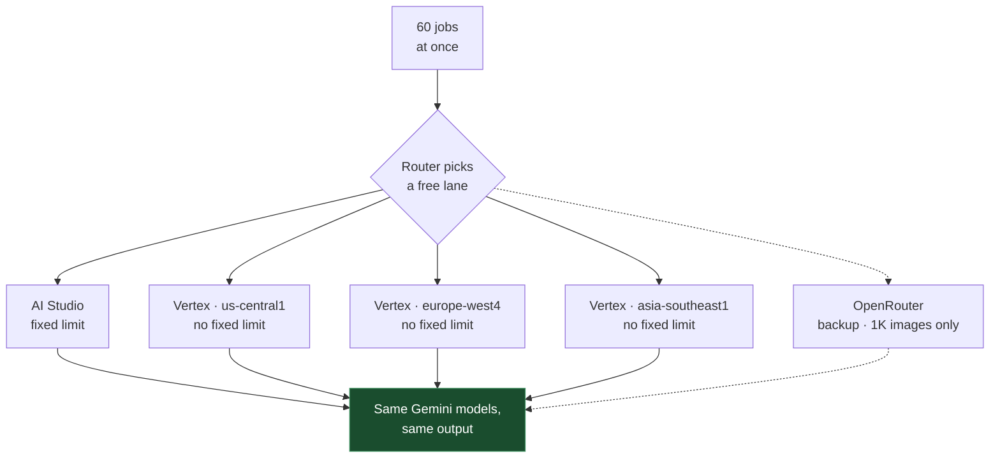
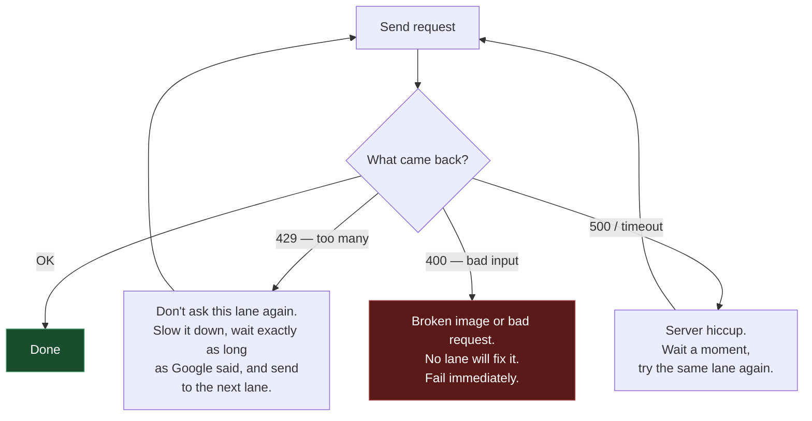
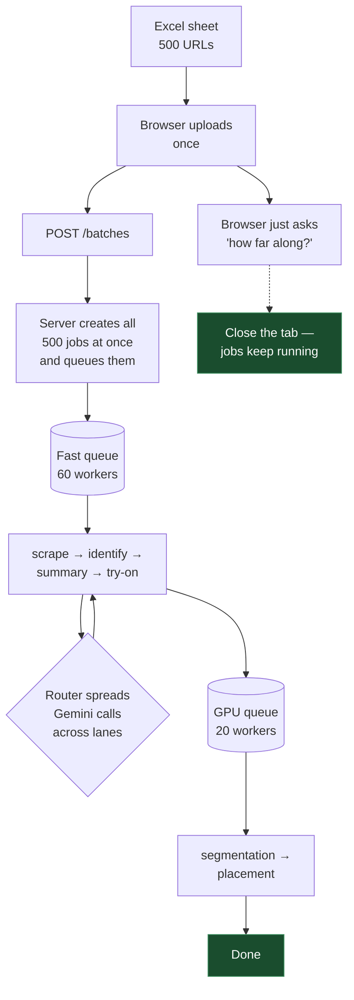

# Bulk Ingestion at Scale

**Service:** `services/ingestion-automated`
**Status:** Proposal — nothing here is built yet
**Date:** 2026-08-12

Part 1 is the plain-English version with diagrams. Part 2 is the implementation detail.

---

# Part 1 — The plain version

## The problem in one line

You drop a sheet of 500 URLs into ingestion. It takes about **8 hours**. It should take about **45 minutes**.

There are **two separate reasons** it's slow. Fixing one without the other doesn't work.

---

## Reason 1 — almost nothing runs at the same time

The batching happens **in your browser**, not on the server.



Two things are wrong here.

**Only 3 URLs move at a time.** The browser sends 3, then sits and waits until all 3 are completely done before sending the next 3. One slow product holds up the other two.

**The browser is in charge.** Close the tab, refresh, or let the laptop sleep and the loop stops. Jobs already sent keep going, but nothing new gets sent. Nobody picks it back up.

Behind that there's a second, smaller limit: the server only runs **5 jobs at once**, no matter what the browser sends.

### Why that adds up to 8 hours

One product takes roughly 5 minutes end to end:

| Step | Roughly |
|---|---|
| Scrape the page + download images | 30–60 sec |
| Identify each image (SigLIP) | 30–60 sec |
| Garment summary (Gemini text) | 15–30 sec |
| Generate the try-on image (Gemini) | 30–60 sec |
| Segmentation (GPU) | 60–120 sec |
| Placement (GPU) | 30–60 sec |

**500 products ÷ 5 at a time × 5 minutes ≈ 8 hours.**

The maths is simple. The only lever is *how many run at the same time*.

---

## Reason 2 — every request goes through one door

Here's the part that stops us just turning the number up.

Every Gemini call in the pipeline uses **one API key, on one Google Cloud project**. Google counts requests **per project**. One project = one bucket.

Adding more API keys does nothing — they all drain the same bucket.


At 5 jobs we stay under the limit. At 60 we go straight over, and Google starts replying **"429 — too many requests."** Jobs then fail, or sit there retrying and burning time.

So turning the worker count up on its own doesn't make things faster. It just makes them fail faster.

### What we have today doesn't help

There is already a fallback list: if `gemini-3-pro-image` fails, try `gemini-3-flash-image`, then `-lite`, then `gemini-2.5-flash-image`.

But those are **four models behind the same key and the same project**. It helps a little — Google counts each model separately — but it does nothing against the project-wide cap, and it quietly downgrades your image quality from Pro to Flash-Lite without telling anyone.

**Different models is not the fix. Different doors to the same models is.**

---

## The fix: more doors

There are three separate ways to reach the exact same Gemini models, each with its own quota counter.

| Door | How it's counted | Notes |
|---|---|---|
| **AI Studio** — what we use today | Fixed requests-per-minute, per Google project | One lane, already full |
| **Vertex AI** | **No fixed limit.** You get served as long as Google has capacity | Same models, same company, **completely separate counter** — even for the same project. And **each region is its own pool** |
| **OpenRouter** | Their own account, their own limit | A reseller. Serves the same Gemini models — but caps images at 1K. Backup lane only |

The Vertex point is the big one. It's the same `gemini-3-pro-image`, the same output, but a different counter — and `us-central1`, `europe-west4` and `asia-southeast1` are **three independent pools**.

So one crowded lane becomes four, three of which have no fixed ceiling at all.



Switching between AI Studio and Vertex is **one flag** in Google's newer SDK — same model names, same results. The library is already in our `package.json`; the services just haven't been moved onto it yet.

---

## What to do when a lane says no

Right now, a "429 — too many requests" is treated the same as a server crash: wait, retry, wait, retry. That's exactly wrong. Google just told us it's full — asking again immediately is pointless.

We should treat the three kinds of failure differently:



Plus two habits on top:

- **Back off automatically.** When a lane gives a 429, halve how many requests we send it, then creep back up as it recovers. Guessing a fixed number is hopeless anyway — Vertex doesn't publish one.
- **Stop knocking on a dead door.** If a lane fails several times in a row, skip it entirely for a while instead of paying the timeout on every job.

---

## How the whole thing should work



---

## The changes, in plain words

### 1. The server does the batching, not the browser
Upload the sheet once. The server creates all 500 jobs immediately and queues them. The browser only asks *"how many are done?"* to draw a progress bar. Close the tab and go home — the batch keeps running.

### 2. Spread requests across lanes
Add Vertex (a few regions) and OpenRouter alongside AI Studio. A small router picks whichever lane is free. Same models, same output.

### 3. Handle 429 properly
Never retry a lane that just said it's full. Move on, slow that lane down, come back to it later.

### 4. Two queues instead of one
Segmentation and placement run on a GPU and take about **2 minutes each**. While a job waits on the GPU it still holds one of the 5 slots — so fast steps like scraping get stuck behind slow ones.

Split them: a **fast queue** (scrape, identify, summary, try-on) and a **GPU queue** (segmentation, placement), each with its own worker count. A jam on the GPU no longer blocks scraping.

### 5. More workers
5 → 60 on the fast queue, ~20 on the GPU queue. **Only after 2 and 3 are in.** Wide without routing is just faster 429s.

### 6. Fewer calls inside each job
- **Image identification** makes **one request per image** today. A product with 8 photos = 8 requests, each able to wake a cold GPU container. Send all 8 in one request: one wake-up per job instead of eight.
- **Image downloads** happen **one after another**. Download 6 at a time.

Neither changes any output. They just stop wasting time.

---

## Before and after

| | Today | After |
|---|---|---|
| Who batches | Browser | Server |
| Running at once | 3 (browser) / 5 (server) | 60 fast + 20 GPU |
| Close the tab | Everything stops | Keeps running |
| Ways to reach Gemini | 1 | 4–5 |
| A 429 costs you | Minutes of retrying | A switch to the next lane |
| Requests per job for image ID | 1 per photo (up to 8) | 1 total |
| Image downloads | One at a time | 6 at a time |
| **500 URLs** | **~8 hours** | **~45 minutes** |

Estimates, not measurements. Time a 50-URL sheet before and after to check.

---

## What this does *not* cover

- **Which AI model runs the try-on.** Still Gemini, same models, same settings. Only the *door* changes.
- **FASHN / simple-vs-complex image routing.** Parked — findings recorded at the end.
- **Quality of the output.** Nothing here changes what any image looks like, only how many are made at once.

---

## Cost note

None of this makes anything cheaper. A 500-URL sheet costs roughly **$67** in try-on image generation alone (500 × ~$0.134), plus GPU time for segmentation and placement.

That number should be on screen *before* someone clicks go on a big sheet.

---
---

# Part 2 — Implementation detail

## Where the ceilings live in code

**Ceiling 1:** [`useBulkIngest.ts:8-11`](../src/components/ingestion-automated/useBulkIngest.ts) (`BATCH_SIZE = 3`, `POLL_MS = 6000`) and `BOSS_TEAM_SIZE` (default 5) consumed at [`queue/worker.ts:12-20`](../services/ingestion-automated/src/queue/worker.ts). There is no server-side batch endpoint in v2.

**Ceiling 2:** every Gemini call uses `GOOGLE_API_KEY` against AI Studio (`generativelanguage.googleapis.com`). The `GEMINI_IMAGE_MODEL_FALLBACKS` chain at [`config/index.ts:32-35`](../services/ingestion-automated/src/config/index.ts) is four models behind that one key and project.

| Route | Quota pool | Auth |
|---|---|---|
| AI Studio (today) | per GCP project, fixed RPM/TPM/RPD by tier | `GOOGLE_API_KEY` |
| Vertex AI | Dynamic Shared Quota — no preset rate limit | service account / ADC |
| OpenRouter | own credits + limits | `OPENROUTER_API_KEY` |

`@google/genai` targets AI Studio or Vertex from one client with one flag — `{vertexai: true, project, location}` — with identical model IDs. Already in root `package.json` at `^1.40.0`, but as a **devDependency**; the services still use the AI-Studio-only `@google/generative-ai`.

---

## Phase 1 — Server-side bulk

### 1.1 `POST /batches`
New `services/ingestion-automated/src/api/routes/batches.ts`: accepts parsed sheet rows as JSON, dedupes, inserts all jobs at `pending`, enqueues them, returns `{batchId, accepted, deduplicated}`. `GET /batches/:batchId` returns rollup progress.

- Migration: `ingestion_batches (batch_id, label, created_by, total, created_at)` + `ingestion_pipeline_jobs.batch_id UUID NULL` with an index.
- Reuse `parseWorkbook` ([`bulkIngest.ts:47`](../src/components/ingestion-automated/bulkIngest.ts)) client-side for validation; reuse the dedupe logic in [`routes/submit.ts`](../services/ingestion-automated/src/api/routes/submit.ts).
- `services/ingestion/src/api/routes/jobs.ts:105-200` is a working v1 reference (`MAX_BATCH_SIZE = 200`, one `batchId` per submission).
- Rewrite `useBulkIngest.ts` to one POST + polling; delete the `BATCH_SIZE = 3` pacing loop. Keep `summarizeBatches` / `actualCost` working by reading the new `batch_id` column instead of the `created_by = 'bulk:<sheet>'` string convention (`bulkIngest.ts:107-109`).

### 1.2 Split the queue
Segmentation and placement block a worker for minutes (`BOSS_MODAL_STEP_TIMEOUT_SECONDS = 5400`). At a high `teamSize` most slots sit parked on Modal while scraping queues behind.

Add a second queue `run-modal-step` with its own `BOSS_MODAL_TEAM_SIZE`. `MODAL_DRIVEN_STATES` already exists at [`send-step.ts:23`](../services/ingestion-automated/src/queue/send-step.ts) — reuse that set to pick the topic in `sendPipelineStep`. Register both in `queue/worker.ts`; both dispatch to the same `dispatch(jobId)`.

### 1.3 Raise the worker pool
`BOSS_TEAM_SIZE` 5 → 60, `BOSS_MODAL_TEAM_SIZE` ~20. **Do not merge before Phase 2.**

---

## Phase 2 — Multi-route Gemini transport

### 2.1 Consolidate onto `@google/genai`
v2 has two ways to call Gemini and neither supports Vertex:
- [`adapters/gemini.ts`](../services/ingestion-automated/src/adapters/gemini.ts) — `@google/generative-ai`, AI Studio only
- [`gemini-vton.adapter.ts:151`](../services/ingestion-automated/src/adapters/vton/gemini-vton.adapter.ts) — raw REST with the **API key in the URL query string** (`?key=...`), which also leaks into any request log

Migrate both. Move `@google/genai` from devDependency to a real dependency and add it to the service's own manifest. Same model IDs, so `GEMINI_TEXT_MODEL` / `GEMINI_IMAGE_MODEL` and the existing fallback lists carry over unchanged.

### 2.2 Route registry
New `services/ingestion-automated/src/adapters/llm/routes.ts`:

```ts
export type LlmRoute = {
  id: string                    // 'ai_studio' | 'vertex:us-central1' | 'openrouter'
  kind: 'ai_studio' | 'vertex' | 'openrouter'
  maxConcurrent: number
  rpm: number | null            // null = DSQ / unmetered; rely on 429 feedback
  weight: number                // share of traffic while healthy
  caps: { maxImageSize: '1K' | '2K' | '4K'; aspectRatios: string[] }
}
```

Config: `GEMINI_ROUTES=ai_studio,vertex:us-central1,vertex:europe-west4,openrouter`, plus `ROUTE_<ID>_MAX_CONCURRENT` / `ROUTE_<ID>_WEIGHT` and credentials (`GOOGLE_API_KEY`, `GOOGLE_VERTEX_PROJECT` + ADC, `OPENROUTER_API_KEY`). All into the zod schema at `src/config/index.ts` — note `FIRECRAWL_MAX_CONCURRENCY` is already parsed there at line 19 and **never used**; don't repeat that mistake.

### 2.3 Router + governor + 429 handling
New `src/adapters/llm/router.ts` — `callText(req)` / `callImage(req)` pick the highest-weight healthy route whose `caps` satisfy the request, then hand off to the governor.

New `src/utils/governor.ts` — `acquire(routeId, fn)` on a named semaphore + optional RPM token bucket. **Port `createLimiter` from [`services/ingestion/src/utils/semaphore.ts`](../services/ingestion/src/utils/semaphore.ts)** — it exists in v1 and is unused in v2.

Split the error classifier. [`isTransientUpstreamError`](../services/ingestion-automated/src/utils/retry.ts) currently lumps 429 with 5xx, so a rate-limit storm costs `{retries: 2}` × 4 models (`gemini-vton.adapter.ts:231-246`) plus 3 pg-boss retries at 60s.

| Class | Trigger | Action |
|---|---|---|
| `rate_limited` | 429, or 403 with a quota reason | **Never retry the same route.** Parse `RetryInfo.retryDelay` / `Retry-After`, halve that route's concurrency (AIMD), pause it for exactly that long, move to the next route |
| `transient` | 408 / 5xx / network | Retry in place with the existing full-jitter backoff |
| `fatal_input` | 400, bad image, unsupported category | No route fixes it — fail fast |

AIMD recovery: add one slot back per healthy interval up to `maxConcurrent`. A static limit is either wasteful or still gets rate-limited; under Vertex DSQ there's no published number to set anyway.

New `src/utils/circuit-breaker.ts` — per-route, opens after K consecutive non-fatal failures, half-opens after cooldown, closes on first success. Shares the route-id keyspace with the governor.

### 2.4 Vertex setup
Service account with `roles/aiplatform.user`; ADC via workload identity in deploy, key file locally. Enable `aiplatform.googleapis.com`. **Verify each intended region actually serves `gemini-3-pro-image` and `gemini-3.1-flash-image`** before adding it to `GEMINI_ROUTES` — regional availability differs from AI Studio. If a backfill needs a guaranteed floor rather than best-effort DSQ, Provisioned Throughput is the lever.

### 2.5 OpenRouter as the overflow lane
OpenRouter caps image output at **1K**, while VTON requests `imageSize: '2K'`, `aspectRatio: '9:16'` (`gemini-vton.adapter.ts:169-173`). Downstream placement lattices are **absolute pixels** — commit `6dc097b8` added `refW`/`refH` scaling precisely because texture size changed underfoot.

Register OpenRouter with `caps.maxImageSize: '1K'`, let the router exclude it for VTON by default, and gate it behind `ALLOW_DEGRADED_ROUTES` for text/enrichment (where resolution is irrelevant) and for VTON only during a declared overflow. Record the serving route on the artifact so a downstream size mismatch is traceable.

### 2.6 Record which route served each call
Add `route_id` and `attempted: [{route, errorKind, ms}]` to the `vton_image` and `garment_summary` artifacts, next to the existing `model_used` / `usage` (`vton-generation.handler.ts:50-52`, `garment-summary.handler.ts:54`). Right now a 429 storm is invisible after the fact. Surface a per-route 429 counter and cost split in `IngestionStatusDialog.tsx`.

### 2.7 Close the two unguarded Modal calls
[`segmenting.handler.ts:74`](../services/ingestion-automated/src/steps/segmenting.handler.ts) and [`placement.handler.ts:32`](../services/ingestion-automated/src/steps/placement.handler.ts) read `MODAL_SEGMENTATION_URL` / `MODAL_PLACEMENT_URL` from bare `process.env` (bypassing zod, so a missing value fails mid-job rather than at boot) and have **no retry and no timeout**. Move into the config schema, wrap with `withRetry` + `AbortSignal.timeout`, and put them behind the governor so 60 concurrent jobs don't stampede Modal.

---

## Phase 3 — Cut the per-job work

Independent of Phases 1–2; each item stands alone.

### 3.1 Batch the SigLIP calls — biggest cheap win
[`identifying.handler.ts:26-33`](../services/ingestion-automated/src/steps/identifying.handler.ts) fires an unbounded `Promise.all`, one HTTP call per image. **The TODO is already written** at [`siglip.ts:197-200`](../services/ingestion-automated/src/adapters/siglip.ts).

- `modal-fashion-embed/siglip_embed.py` — accept `{images_b64: [...]}` → `{vectors: [...]}` alongside the existing single-image shape.
- `siglip.ts` — add `embedImages(b64[])`; keep `embedImage` as a one-element wrapper. The `anchorCache` in-flight-promise cache (`siglip.ts:176-191`) stays.

### 3.2 Parallelise image downloads
[`scraping.handler.ts:46-71`](../services/ingestion-automated/src/steps/scraping.handler.ts) downloads gallery images in a **sequential `for` loop** at 30s timeout each. Change to a bounded `Promise.all` (concurrency 6) via the same limiter.

### 3.3 Enrichment → Gemini Batch API
`generateEnrichment` is already best-effort and non-blocking (`garment-summary.handler.ts:94-96`). Batch runs at **50% cost** and draws on a **separate enqueued-token quota rather than interactive RPM** — so it removes one Gemini call per job from the 429 surface entirely.

A working implementation exists to copy: `supabase/functions/create-batch-enrichment/index.ts` (`ai.batches.create`, up to 100 per job) + `poll-batch-enrichment/index.ts`. Drop enrichment into a `pending_enrichment` table drained by a scheduled batch submit.

### 3.4 Modal burst tuning
`services/segmentation/modal_app.py` has `scaledown_window=10` — at 60 concurrent jobs that's constant cold-starting. Raise to ~300s, set `max_containers`, add `@modal.concurrent(max_inputs=N)`; the pattern is already used in `services/segmentation/eraser/modal_app_eraser.py:73`. Consider `min_containers=1` during a declared bulk window.

---

## Ordering

1. **Phase 2** (routes + governor + 429 classes) — merge first, it's the safety net.
2. **Phase 1.1 / 1.2** (batch endpoint, queue split) — independent, can land in parallel.
3. **Phase 1.3** (`teamSize` 5 → 60) — only after both.
4. **Phase 3** — any time.

---

## Verification

**Phase 2**
- Unit-test the error classifier against captured Gemini 429 / 500 / 400 bodies; assert `retryDelay` is parsed off `RetryInfo`.
- Governor tests: acquire/release, RPM bucket, queue-on-saturation, AIMD halving on `rate_limited`, gradual recovery.
- Router test: a route whose `caps.maxImageSize` is `1K` is not selected for a 2K request unless `ALLOW_DEGRADED_ROUTES` is set.
- Live: point `ai_studio` at a deliberately low-tier key, run 50 URLs, confirm traffic shifts to Vertex and **zero jobs fail** — the 429s should show as route switches in the artifacts, not errors.
- Kill one Vertex region's credentials mid-run; confirm the breaker opens and the batch continues.

**Phase 1**
- Submit a 50-URL sheet against staging. Assert: closing the browser tab does not stop progress; `GET /batches/:id` keeps advancing; wall-clock beats the current 3-at-a-time loop by ≥5×.
- Then a 500-URL sheet with `teamSize: 60` and all routes on. Target under an hour. Watch pg-boss queue depth to confirm `run-modal-step` isn't starving `run-pipeline-step`.

**Phase 3**
- Confirm one SigLIP call per job (not N) via Modal container-start count.
- Compare `duration_ms` on the `scraping` artifact before/after 3.2.

**Cost** — `actualCost()` in `bulkIngest.ts:201` should break down per route.

**Repo-wide** — `bun run typecheck` and `bun run lint`. Note the known-red baseline in `CLAUDE.md` (7 type errors, 275 lint errors); leave touched files no worse, don't chase pre-existing failures.

---

## Parked: FASHN and the simple/complex image gate

Not part of this work. Recorded so it isn't re-derived later.

- **FASHN is already fully built and never called.** `modal-fashn-vton/modal_app.py` self-hosts `fashn-AI/fashn-vton-1.5` (Apache-2.0) on an L4; adapter, registry, tests and env vars all exist. `resolveVtonModel` defaults to `gemini_nano_banana`, and `AddItemDialog.tsx:18-22` hard-pins every job to it.
- **Hard blocker if revived:** `services/ingestion-automated/assets/fashn-avatar.png` is byte-identical to `gemini-avatar-female.png` (MD5 `c5ad3dbdccbd2b1e10966e5d035fc165`). The real `avatar_clean.png` is missing. FASHN is maskless and preserves non-target regions, so a clothed base leaves garment artifacts — any A/B run today measures the wrong thing.
- `garment_photo_type` is never forwarded by `api_render` (`modal_app.py:106-119`), so flat-lay mode is unreachable over HTTP.
- **The simple/complex signal already exists and is discarded.** `deriveComplexity` (`gemini.ts:260-268`) writes `complexity_level` into the `garment_summary` artifact one step before VTON; nothing reads it. SigLIP already persists `Flat Lay` vs `Live Model` plus front/back with confidence and uncertainty flags per image, and a 4-slot map on the `vton_image_selection` artifact.
- An eval harness with 1441 images, ~30 rendered items per category, a 32-item gold set and a `GARMENT | MODEL | FLAT-LAY` comparison builder sits in the gitignored `services/segmentation/vton_intern_pack/`.
