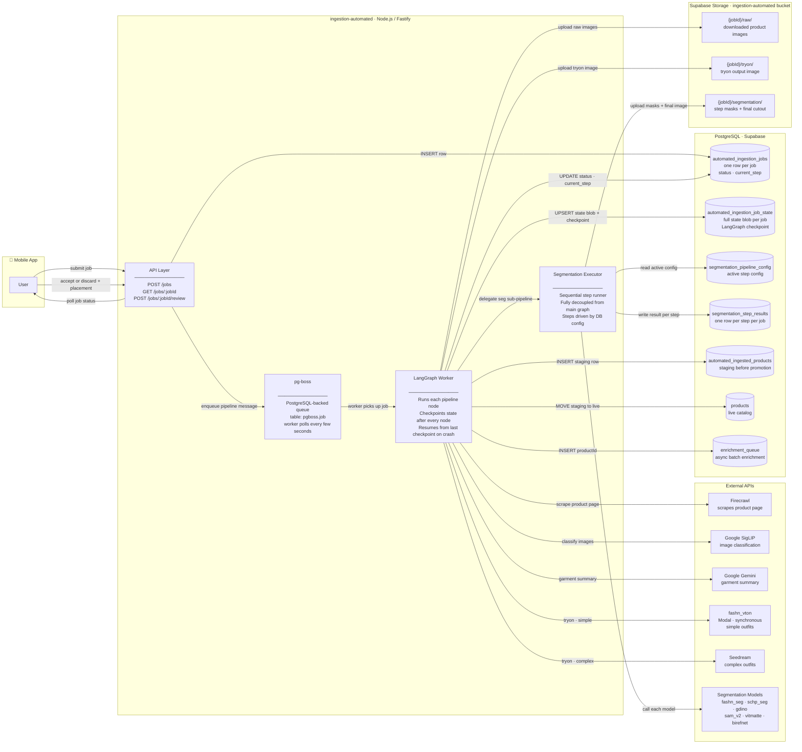
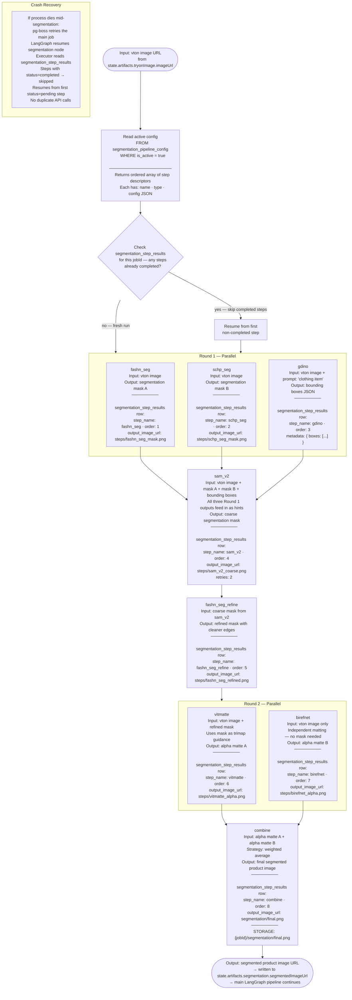

# Ingestion Automated — Implementation Plan

**Status:** Planning  
**Service:** `services/ingestion-automated`  
**Date:** 2026-06-19

---

## Diagram 1 — System Architecture (Component Communication)

> Who talks to whom, and over what interface.



---

## Diagram 2 — Full Pipeline Flow

> Step by step: what happens, what is written to state, which DB table is hit.

```mermaid
flowchart TD
    START(["👤 POST /jobs
    url · gender · category · subcategory"])

    DEDUP{"Deduplicate
    MD5 canonical URL
    check automated_ingestion_jobs"}

    EXIST(["↩ Return existing jobId + productId
    no pipeline started"])

    INTAKE["API — Job Intake
    ─────────────────────
    DB WRITE: automated_ingestion_jobs
      status: queued
      gender · category · subcategory stored
    ─────────────────────
    pg-boss: enqueue pipeline job
    API returns jobId immediately"]

    START --> DEDUP
    DEDUP -->|"same URL, status ≠ discarded"| EXIST
    DEDUP -->|"new URL"| INTAKE

    INTAKE -.->|"worker picks up job"| CRAWL

    subgraph LG["⚙️  LangGraph Worker  —  automated_ingestion_job_state updated after every node"]

        CRAWL["🔍 crawl   retries: 3  backoff: 1s → 2s → 4s
        Firecrawl scrapes the product URL
        ─────────────────────
        STATE: artifacts.htmlPath
               artifacts.crawlMeta
               { title · brand · price · description }
        DB: automated_ingestion_jobs → status: crawling"]

        EXTRACT["📄 extract   retries: 2  backoff: 1s → 2s
        Parse all image URLs from crawl output
        ─────────────────────
        STATE: artifacts.draftImages[]
               { url · alt · width · height }"]

        DOWNLOAD["⬇️ download   retries: 3  backoff: 1s → 2s → 4s
        Fetch each image · upload to Supabase
        ─────────────────────
        STATE: artifacts.rawImages[]
               { hash · storagePath · width · height }
               flags.downloadReady: true
        STORAGE: {jobId}/raw/0.jpg · 1.jpg · ...
        DB: automated_ingestion_jobs → status: downloading"]

        IDENTIFY["🏷️ identify   retries: 2  backoff: 1s → 2s
        Google SigLIP classifies each downloaded image
        Labels: model_front · model_back · model_side
                flatlay_front · flatlay_back · detail_texture
        Best image for tryon selected by priority:
          flatlay_front → model_front → flatlay_back → model_side
        ─────────────────────
        STATE: artifacts.imageClassifications[]
               { hash · storagePath · label · confidence }
               artifacts.bestTryonImagePath
               flags.identifyReady: true
        DB: automated_ingestion_jobs → status: identifying"]

        GS["📋 garment_summary   retries: 3  backoff: 1s → 2s → 4s
        Google Gemini · text model
        Injects user inputs: gender · category · subcategory
        ─────────────────────
        STATE: artifacts.garmentSummaryPayloads[]
               { techPack · garmentPhysics · itemName
                 colorAndFabric · complexityLevel }
               flags.garmentSummaryReady: true
        DB: automated_ingestion_jobs → status: summarizing"]

        TRYON_R{"complexityLevel?"}

        FASHN["fashn_vton
        Modal · synchronous
        ─────────
        retries: 3
        backoff: 2s → 4s → 8s"]

        SEED["seedream
        ─────────
        retries: 5
        backoff: 5s → 10s → 20s → 40s → 80s"]

        TRYON_OUT["STATE: artifacts.tryonImage
        { imageUrl · storagePath
          modelUsed · inferenceMs }
        flags.tryonReady: true
        STORAGE: {jobId}/tryon/front.jpg
        DB: automated_ingestion_jobs → status: tryon_pending"]

        SEG_N["✂️ segmentation   retries: 2  backoff: 2s → 4s
        Calls segmentation executor
        See Diagram 3 for internal steps
        ─────────────────────
        STATE: artifacts.segmentation
               { configId · segmentedImageUrl · storagePath }
               flags.segmentationReady: true
        STORAGE: {jobId}/segmentation/final.png
        DB: segmentation_step_results — one row per step
        DB: automated_ingestion_jobs → status: segmenting"]

        FIN["📦 finalize
        Assembles full product record from all prior state
        ─────────────────────
        DB: automated_ingested_products ← draft row inserted
        DB: automated_ingestion_jobs → status: finalizing"]

        RPAUSE["⏸️ review_pause
        Pipeline pauses — waits for user decision
        ─────────────────────
        STATE: pause.reason: awaiting_review
        DB: automated_ingestion_jobs → status: awaiting_review"]
    end

    INTAKE -.-> CRAWL
    CRAWL --> EXTRACT --> DOWNLOAD --> IDENTIFY --> GS
    GS --> TRYON_R
    TRYON_R -->|"simple"| FASHN --> TRYON_OUT
    TRYON_R -->|"complex"| SEED --> TRYON_OUT
    TRYON_OUT --> SEG_N --> FIN --> RPAUSE

    RPAUSE -->|"result surfaced to user"| REVIEW

    REVIEW(["👤 User reviews result
    Sees tryon image + segmented product on avatar
    Drags product to set placement on body
    ─────────────────────
    POST /jobs/:jobId/review
    { action: 'accept' | 'discard'
      placement: { x · y · bodyPartsVisible } }"])

    REVIEW --> RINT

    subgraph END["Review Resolution"]
        RINT["review_interrupt
        Reads action + placement from signal"]

        PROMOTE["✅ promote
        ─────────────────────
        DB: automated_ingested_products → products
            + placement_x · placement_y · body_parts_visible
        DB: automated_ingestion_jobs → status: completed
        DB: enrichment_queue ← productId inserted
             async worker enriches in batch later"]

        DISCARD["❌ discard
        ─────────────────────
        DB: automated_ingestion_jobs → status: discarded
        Nothing promoted"]
    end

    RINT -->|"accept"| PROMOTE
    RINT -->|"discard"| DISCARD

    PROMOTE --> ASYNC[["async enrichment worker
    reads enrichment_queue in batches
    calls Gemini · generates fit · feel · vibes
    description · material · occasion
    updates products table"]]
```



---

## Diagram 3 — Segmentation Pipeline (Internal)

> Fully decoupled from the main LangGraph. Steps are driven by `segmentation_pipeline_config` in DB.
> Each step result is persisted to `segmentation_step_results` immediately — crash recovery resumes from the first incomplete step.



---

## Key Design Decisions (Summary)

| Decision | Choice | Reason |
|----------|--------|--------|
| Orchestration | LangGraph + pg-boss | Already in stack, proven patterns |
| Image classification | Google SigLIP | Purpose-built zero-shot classifier, fast + cheap |
| Tryon — simple | fashn_vton via Modal | Synchronous, deterministic |
| Tryon — complex | Seedream | Adapter is async-capable by design |
| Tryon retries | fashn_vton: 3 · Seedream: 5 | Different backoff per provider |
| Circuit breaker | Not now | Revisit for Seedream when hosting confirmed |
| Placement | User input at review step | Automated placement is unreliable; user sees result on avatar anyway |
| Enrich | Async batch after promote | Keeps main pipeline fast; enrichment is not blocking |
| Segmentation coupling | Fully decoupled executor | Steps driven by DB config — swap a model with no code change |
| Deduplication | MD5 of canonical URL | Return existing jobId + productId, no re-processing |

---

## DB Tables

| Table | Written by | When |
|-------|-----------|------|
| `automated_ingestion_jobs` | API + every node | On submit, on every status transition |
| `automated_ingestion_job_state` | LangGraph after every node | Checkpoint + full state blob |
| `segmentation_pipeline_config` | Manual / migrations | Config only — read during segmentation |
| `segmentation_step_results` | Segmentation executor | One row per step, written immediately after each step |
| `automated_ingested_products` | finalize node | Staging row before promotion |
| `products` | promote node | Final promotion after user accepts |
| `enrichment_queue` | promote node | ProductId queued for async batch enrichment |

---

## Retry Policy Per Node

| Node | Retries | Backoff |
|------|---------|---------|
| crawl | 3 | 1s → 2s → 4s |
| extract | 2 | 1s → 2s |
| download | 3 | 1s → 2s → 4s |
| identify | 2 | 1s → 2s |
| garment_summary | 3 | 1s → 2s → 4s |
| tryon — fashn_vton | 3 | 2s → 4s → 8s |
| tryon — seedream | 5 | 5s → 10s → 20s → 40s → 80s |
| segmentation (node) | 2 | 2s → 4s |
| each segmentation step | 2 | 1s → 2s |

---

## Folder Structure

```
services/ingestion-automated/
  src/
    api/
      index.ts
      routes/
        submit.ts           # POST /jobs
        status.ts           # GET /jobs/:jobId
        review.ts           # POST /jobs/:jobId/review
    adapters/
      crawler/              # Firecrawl (reuse from services/ingestion)
      llm/                  # Gemini wrappers (reuse)
      storage/              # Supabase storage (reuse)
      tryon/
        fashn-vton.ts
        seedream.ts
        index.ts            # Routes: simple → fashn_vton, complex → seedream
      segmentation/
        fashn-seg.ts
        schp-seg.ts
        gdino.ts
        sam-v2.ts
        fashn-seg-refine.ts
        vitmatte.ts
        birefnet.ts
        combine.ts
        executor.ts         # Sequential runner with crash recovery
        registry.ts         # step name → adapter
    config/
      index.ts              # Zod-validated env vars
    db/
      supabase.ts
    domain/
      state.ts              # AutomatedPipelineState type
      state-store.ts        # Load/save from automated_ingestion_job_state
      job-catalog.ts        # CRUD on automated_ingestion_jobs
      dedup.ts              # MD5 deduplication logic
      contracts.ts          # Zod schemas for API inputs
    orchestration/
      graph.ts              # LangGraph StateGraph definition
      nodes/
        crawl.ts
        identify.ts
        garment-summary.ts
        tryon.ts
        segmentation.ts     # Thin shell — calls executor
        finalize.ts
        review-pause.ts
        review-interrupt.ts
        promote.ts
      state-merge.ts
      checkpointer.ts
      resume.ts
    queue/
      boss.ts
      worker.ts
    utils/
      logger.ts
    index.ts
```

---

## Open Decisions

| # | Question |
|---|----------|
| 1 | Shared adapters — symlink, monorepo `packages/adapters`, or copy from existing service? |
| 2 | Seedream hosting — Modal or other? Affects whether adapter is truly sync or polling-based. |
| 3 | `automated_ingested_products` schema — copy `ingested_products` exactly or strip unused fields? |
| 4 | Segmentation parallel steps — run Round 1 (fashn_seg + schp_seg + gdino) truly in parallel via `Promise.all`, or keep sequential for simpler crash recovery? |
