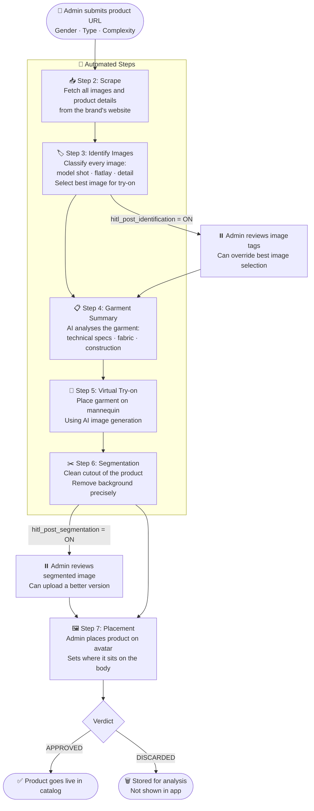
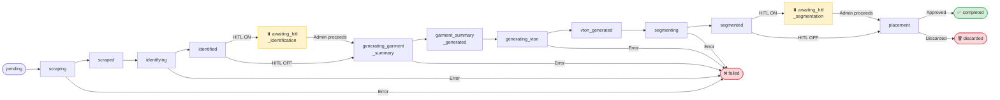

# Ingestion Pipeline V2 — Product Overview

**For:** Co-founder (non-technical)  
**Date:** 2026-06-23

---

## What is this?

This is the system that takes a product link (from any fashion brand's website) and automatically prepares that product to be available in the Atlyr app — fully processed, with a clean product image, ready to be shown on a user's avatar.

Previously, this required a lot of manual work from our team at every step. This new pipeline automates almost all of it. Humans are only involved at key review points — and even those can be turned off for a fully automated run.

---

## What does it produce?

Given a product URL, the pipeline produces:

1. **A virtual try-on image** — the garment on a mannequin
2. **A clean product cutout** — the garment segmented out, no background, ready to overlay on any body
3. **A fully catalogued product** — with all metadata (fit, feel, fabric, category) ready for the app

---

## The Pipeline — Plain English



---

## The State Machine — What It Means

Think of the state machine as a **progress tracker**. At every moment, each job has a single current state that tells us exactly where it is in the pipeline.



### State in plain English

| State | What it means |
|-------|--------------|
| `pending` | Job created, waiting to start |
| `scraping` | Fetching images from the brand website |
| `scraped` | Images downloaded and saved |
| `identifying` | AI classifying each image (model shot? flatlay? detail?) |
| `identified` | Best image for try-on selected |
| `awaiting_hitl_identification` | ⏸️ Waiting for admin to review image selection |
| `generating_garment_summary` | AI reading the garment's technical specs |
| `garment_summary_generated` | Garment fully understood by AI |
| `generating_vton` | AI generating mannequin try-on image |
| `vton_generated` | Try-on image ready |
| `segmenting` | AI cutting out the product from the background |
| `segmented` | Clean product cutout ready |
| `awaiting_hitl_segmentation` | ⏸️ Waiting for admin to review the cutout |
| `placement` | ⏸️ Waiting for admin to place product on avatar + give verdict |
| `completed` | ✅ Product live in catalog |
| `discarded` | 🗑️ Admin rejected — stored for analysis |
| `failed` | ❌ Something went wrong — can be restarted |
| `cancelled` | Manually stopped |

---

## Admin Control Points (HITL)

There are **3 points** where an admin can intervene. All are optional and configurable per job.

### 1. After Image Identification (optional)
**When:** `hitl_post_identification = true`

Admin sees all images from the product page with their labels. They can:
- See which image was auto-selected for try-on
- Override the selection if they prefer a different image
- Hit **Proceed** to continue

### 2. After Segmentation (optional)
**When:** `hitl_post_segmentation = true`

Admin sees the AI-generated product cutout. They can:
- Accept it as-is
- Upload a manually improved version
- Hit **Proceed** to continue

### 3. Placement & Verdict (always required)
Admin sees the clean product cutout overlaid on a standard avatar. They:
- Drag the product to the correct position on the body
- Give a final verdict: **APPROVE** or **DISCARD**

---

## The Dashboard — What You Can Build

The admin dashboard would work like this:

---

### Job List View

A table showing all submitted jobs with their current state at a glance:

```
Job ID    | Product          | State                    | Submitted  | Action
----------|------------------|--------------------------|------------|--------
abc-123   | Nike Tee         | ✅ completed             | 2h ago     | View
def-456   | Mango Dress      | ⏸️ awaiting_placement    | 30m ago    | Review →
ghi-789   | Zara Jeans       | 🔄 generating_vton       | 5m ago     | Watching
jkl-012   | H&M Top          | ❌ failed (vton step)    | 1h ago     | Restart →
```

Filter by state — e.g. "Show all jobs awaiting review" — gives you exactly the jobs that need your attention.

---

### Job Detail View

Click any job to see its full history:

```
Job: abc-123 — Nike Oversized Tee
Current state: completed ✅

Timeline:
  ✅ scraped              2h 5m ago    (12 images downloaded)
  ✅ identified           2h 3m ago    (flatlay_front selected for vton)
  ✅ garment_summary      2h 1m ago    (simple complexity)
  ✅ vton_generated       1h 58m ago   (fashn_vton, 3.2s)
  ✅ segmented            1h 45m ago   (8 segmentation steps)
  ✅ placement            1h 30m ago   (Admin: Aayush — APPROVED)

Images:
  [try-on image]    [segmented cutout]    [all 12 product images]

Verdict: APPROVED by Aayush at 1:30pm
```

---

### Restart From Any Step

If a job fails or produces a bad result, you can restart it from any step without reprocessing everything from the beginning.

Example: the try-on image looks wrong → restart from `generating_vton`.

```
Select job → Click "Restart from step" → Choose step → Confirm
```

The system:
1. Clears only the data from that step onwards (keeps scraping, identification, garment summary)
2. Re-runs from the chosen step
3. Produces fresh output

This means **you never have to re-scrape or re-process the whole product** just because one step had an issue.

---

### Verdict Tracking

Every job has a verdict trail:

```
Verdict history for this product:
  Run 1 — Jun 19 — DISCARDED — "Segmentation too rough around collar"
  Run 2 — Jun 20 — APPROVED  — "Re-ran segmentation, looks clean"
```

Because discarded jobs are **always stored** (never deleted), you can:
- See what percentage of jobs get discarded
- See which step causes most failures
- Understand which product types have poor quality output
- Go back and re-process a discarded job later

---

## How Multiple Jobs Run

The system processes multiple jobs simultaneously. While Job A is waiting for the AI try-on model to respond, Job B's images are being classified, and Job C is being scraped — all at the same time.

```
Job A: ────[scraping]──────[identifying]──[waiting for vton AI...]
Job B:           ────[scraping]──[identifying]────────────────────
Job C:                    ────[scraping]──[identifying]──[garment summary]
```

The number of jobs that run simultaneously is controlled by a single setting (`teamSize`), tuned based on how much load our AI model endpoints can handle.

---

## What Gets Stored and Why

| Data | Where | Why kept |
|------|-------|---------|
| All downloaded images | Supabase storage (temp) | Needed by pipeline steps |
| Try-on image | Supabase storage | Shown at review + in catalog |
| Segmentation masks | Supabase storage (temp) | Debug if output looks wrong |
| Final segmented image | Supabase storage | Used in app |
| All step outputs | Database (temp, 7-day cleanup) | Crash recovery + debugging |
| All jobs (approved + discarded) | Database (permanent) | Analysis + quality tracking |
| Products (approved only) | Database (permanent) | Live catalog |

Temporary data is automatically cleaned up after 7 days for completed jobs. Nothing important is ever lost.
