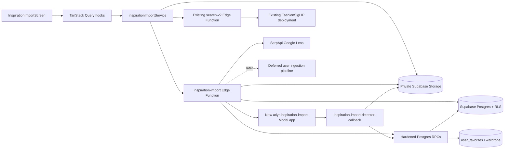

# Inspiration import: production implementation plan

**Status:** initial image-first Supabase/Modal version deployed for unlinked testing; immutable-import
schema simplification implemented locally and pending coordinated deployment; current delivery stops
before web-product ingestion

**Inputs:** image first; URL/page input is represented in the contracts but has no active UI yet

**Garment scope:** tops and bottoms only

**Predecessor:** [`visual-search-implementation.md`](./visual-search-implementation.md), the completed
FASHN + GroundingDINO hypothesis harness

### Implementation status (31 August 2026)

The image-first implementation now exists in this branch:

- Supabase migrations with four workflow tables, private Storage, and hardened RPCs;
- two Supabase Edge Functions for authenticated actions and signed detector callbacks;
- separate, asynchronous `atlyr-inspiration-import` Modal entry point with
  multi-candidate FASHN + GroundingDINO logic and bounded 500 KB crops;
- unlinked `/inspiration-import/:importId?` frontend with image upload, candidate selection,
  catalogue retrieval/mannequin preview, Wardrobe multi-select, web fallback, and receipt states.

The initial migration, two Edge Functions, and isolated Modal app have been deployed for the unlinked
test route. The follow-up immutable-import cleanup migration and matching contracts are pending. No
existing production Modal pipeline has been changed. The superseded Fastify prototype, its direct
Postgres pool, and its queue worker have been removed. Both ingestion services remain outside this
feature.

Cleanup verification completed: Vite production build, targeted frontend lint, Python compilation,
TypeScript transpilation for both Edge Functions, and an isolated Supabase Postgres 17 migration
chain covering detection start, finalization, candidate selection, atomic commit, removed columns,
and replacement RPC signatures. The two Inspiration Jest files are not runnable with the repository's
current Jest setup because TypeScript/ESM transformation is not configured; the full TypeScript check
also reports unrelated existing errors outside this feature.

### Product-flow amendment (4 September 2026)

This section supersedes the catalogue multi-select/Wardrobe-commit wording elsewhere in this plan:

- every confirmed garment category defaults to its first `search-v2` result and keeps exactly one
  active catalogue result for the Studio look;
- tapping a catalogue card changes that category's Studio selection;
- each card has independent Favorite and Wardrobe controls, backed by separate
  `user_favorites.collection_slug` memberships;
- removing a Favorite deletes only the `favorites` membership and does not remove Wardrobe or
  custom-moodboard memberships;
- the primary action creates a private, non-feed Studio draft and opens it instead of adding the
  selected products to Wardrobe;
- `inspiration_imports.studio_outfit_id`, plus final selection rows with `outfit_id` and
  `status = 'opened_in_studio'`, preserve the import-to-outfit audit trail;
- Google Lens results remain browse/staging-only and are not converted into Studio products by this
  amendment.

### Web-result and unified-selection amendment (4 September 2026)

This section supersedes the older persisted-Lens-cache and independent catalogue/web-selection
wording elsewhere in this plan:

- SerpApi searches use unqualified Google Lens: neither `type` nor a text query is sent, and no
  application result-count cap is applied;
- results are retained only when they have price, explicit stock, or rating-plus-review commerce
  metadata, or their URL belongs to the curated popular-shopping-domain allowlist;
- complete Lens result rails are ephemeral. The SPA keeps them in candidate-scoped
  `sessionStorage` entries with a one-hour expiry; the database is not a search-result cache;
- the Edge Function signs every ephemeral result. The final staging action verifies the signature,
  import/candidate binding, and expiry before storing it;
- only each category's final selected web result is written to `inspiration_import_web_results`,
  together with its `selected_for_ingestion` selection row;
- top and bottom each have one choice total across inventory and web. Selecting a choice from one
  source replaces the other source in that category, and tapping the selected card clears it;
- a full mannequin is rendered only when both choices are inventory items. A lone inventory choice
  is cropped from the garment's renderer-reported opaque bounds (with a static top/bottom crop while
  those bounds load); an active web choice replaces the mannequin with an aspect-ratio-preserving
  `object-cover` product image;
- the import preview uses the placement mannequin only when every visible inventory garment is
  compatible with the body that renderer will choose. Otherwise it uses the legacy renderer rather
  than silently filtering an unplaced garment before its image is loaded.

### Staging-only amendment (4 September 2026)

This section supersedes every submit/poll/publish statement below for the current delivery:

- when any final choice is from Lens, **Save selections for ingestion** atomically persists the
  complete look before returning: catalogue choices become `selected_for_outfit`, web choices and
  their product URLs become `selected_for_ingestion`, and the import becomes `selections_staged`;
- no ingestion-service HTTP endpoint is called and no ingestion job is created or polled;
- no outfit is created for a staged look. A later ingestion integration will create the private
  outfit only after every selected web product succeeds;
- the future ingestion service can read the selected garment, candidate category, and product URL
  from `inspiration_import_selections` joined to `inspiration_import_web_results` and
  `inspiration_import_candidates` using its service-role client.

## 1. Objective

Build a separate authenticated screen where a user can upload an inspiration photo, inspect every
top and bottom candidate found in it, and choose up to one candidate from each category. When both
are selected, the results screen retrieves both categories in parallel and switches between their
cached result rails without repeating either request.

The user chooses zero or one result for each confirmed category across inventory and Google Lens.
Inventory results use the existing mannequin and can open as a Studio draft. Lens is an explicit,
paid fallback for the same selected crop; its results use external product images and are never
passed to the mannequin renderer.

Web-result clicks remain browser-only. When the final selection contains a Lens result, the primary
action becomes **Save selections for ingestion**. It verifies the signed results and atomically
persists the complete final catalogue/web selection set. Ingestion and outfit creation are deferred.

## 2. Locked product decisions

1. Detection returns every viable top and bottom candidate in the photo.
2. A confirmed selection may contain one top, one bottom, or one of each. It can never contain two
   candidates from the same category.
3. The frontend confirms one top, one bottom, or one of each. It retrieves every confirmed category
   immediately after confirmation.
4. When both categories are confirmed, their two catalogue retrievals run in parallel and are
   cached independently by import, candidate, category, and profile gender.
5. Google Lens is not run in parallel with catalogue retrieval. It is an explicit user action.
6. Top and bottom each have one active choice across inventory and web, or may be empty.
7. Choosing an inventory result replaces that category's web choice and choosing a web result
   replaces its inventory choice.
8. At most one Google Lens result per confirmed category can be submitted for ingestion.
9. Selecting and deselecting cards does not write web rows. Only the final action persists the
   complete selected set; it does not create ingestion jobs.
10. Image input ships first. The backend contract keeps `source_kind = image | url` so URL support
    does not require another redesign.
11. The new route remains unlinked from Search, navigation, share sheets, and other existing entry
    points until the flow is approved.
12. Database and private Storage changes are allowed.

## 3. Current scope and exclusions

### Included now

- private authenticated image upload;
- import-draft creation and resumption by import ID;
- one FASHN parse and one combined GroundingDINO pass per immutable source import;
- multiple top/bottom candidate boxes and candidate crops;
- atomic backend selection of up to one candidate per category;
- category-aware frontend selection and parallel matching for the confirmed top and bottom;
- per-selected-crop image retrieval through the existing `search-v2` path;
- category- and profile-gender-constrained catalogue results, including unisex products;
- mannequin swapping for catalogue products that have valid placement data;
- one inventory-or-web selection per confirmed category;
- on-demand SerpApi Google Lens product search;
- final-action persistence of the complete catalogue/web selection set;
- a durable staging state that a future ingestion worker can read;
- private asset retention with explicit user-driven deletion;
- direct, authenticated `/inspiration-import` route for development and review.

### Explicitly excluded now

- shoes, dresses, jumpsuits, bags, scarves, jewellery, and accessories;
- searching every detected candidate;
- automatic or parallel Google Lens calls;
- SAM2 or the production garment-cutout segmentation pipeline;
- adding the extracted inspiration crop itself to Wardrobe;
- deciding whether a user-ingested item is private or global;
- rendering Google Lens results on the mannequin;
- try-on, board save, or checkout;
- a Search lens-button, feed share-sheet, profile, or navigation entry point;
- modifications or redeployments of existing production Modal applications.

Outerwear such as jackets, coats, overshirts, and blazers is treated as `top` when detected as a
top. Overlapping layers are best-effort in v1: FASHN is semantic parsing, not instance segmentation,
so a jacket and shirt occupying the same pixels may collapse into one candidate.

## 4. User flow

```text
/inspiration-import
  -> upload image
  -> scan once for all top/bottom candidates
  -> select one top, one bottom, or one of each
  -> Find matches
  -> run search-v2 in parallel for every confirmed category
  -> switch between cached category result rails without another API call
       -> tap a catalogue card: select/deselect that category on the mannequin
       -> optional Search online
            -> Lens cards use external images only
            -> select/deselect at most one web result for that category
  -> Open in Studio for inventory-only choices
  -> Save selections for ingestion when either choice is from Lens
       -> atomically persist final catalogue choice(s) and signed web choice(s)
       -> stop at the durable selections_staged state
```

Selection is category-scoped: `top` and `bottom` each hold either one inventory result, one web
result, or null. Selecting a card from the other source replaces it, and tapping the active card
clears it. Returning from Web search to Inventory clears that category's browser choice and shows
the empty mannequin until the user explicitly selects an inventory match.

## 5. Screen states

### 5.1 Bring inspiration

- Show `Image` and `URL` input modes.
- `Image` is active in this release.
- `URL` is visible as coming later, without accepting input yet.
- Accept JPEG, PNG, and WebP up to 10 MB.
- Create the import record before upload so the Storage path is import-scoped.

### 5.2 Detecting

- Keep the uploaded photo visible with a scan treatment.
- The request analyses tops and bottoms together; the user does not choose a category first.
- A failure is retryable on the same import.

### 5.3 Select garment

- Draw every viable top/bottom candidate box over the source image.
- Show crop cards below the source image only for candidates the user has selected.
- Selection permits at most one top and one bottom. Tapping another candidate replaces the current
  selection in that category; tapping the active box/card clears it.
- CTA copy includes the selected count and remains disabled until at least one candidate is selected.
- If nothing is found, explain that no top/bottom was found and let the user retry or choose a
  clearer photo. Manual crop-and-rescan is deferred until the base flow is validated.

### 5.4 Catalogue matches

- Show the selected inspiration crop as the reference.
- Show one bare mannequin using the user's current mannequin/profile configuration.
- Tapping a catalogue card selects it; tapping the active card clears that category.
- Selecting it clears any browser-held web choice for the same category.
- Products missing usable 3D placement data use their legacy placement fields instead of being
  silently omitted from the mannequin.
- Keep `Search online` as the final tile/action after catalogue results and also show it prominently
  in the empty-results state.

### 5.5 Web matches

- Replace the mannequin pane with the external product image supplied by SerpApi, using
  aspect-ratio-preserving cover sizing.
- Display merchant domain and link attribution.
- Permit one selected web result per category. Choosing another replaces it; tapping it clears it.
- Selecting a web result clears the inventory choice only for the same category.

### 5.6 Final Studio action

- Inventory-only choices use **Open piece/look in Studio**.
- Any web choice uses **Save selections for ingestion**.
- Atomically persist all final catalogue selections and web-result URLs before showing the saved
  receipt. Do not start, poll, or implement ingestion in this flow yet.
- Do not create the private draft or outfit for a staged web selection. A future ingestion workflow
  will create the outfit only after every selected web item has a published `products.id`.
- Do not write unselected Lens results or intermediate card-click state to Postgres.
- Provide a retry if staging failed and preserve local selections.
- The staged receipt does not navigate to Studio in this release.

## 6. System architecture



The browser invokes `inspiration-import` through the existing authenticated Supabase client. The
platform verifies the user JWT before the handler runs, and the handler derives the user ID from
verified auth context. The browser never receives a Modal token, Modal callback secret, SerpApi
key, service-role key, or database connection string.

The internal callback has a separate trust boundary:

- `inspiration-import-detector-callback` accepts no user JWT. It accepts only a timestamped HMAC
  signed by the new Modal app, rejects replayed/expired signatures, and finalizes only the current
  detection attempt.

Heavy image work remains in Modal. Edge Functions only validate state, perform bounded byte
transfers, call external APIs, and persist results. This is required because hosted Edge Functions
have bounded CPU, memory, wall-clock, and request-idle budgets and do not support `sharp`/libvips.

## 7. Production isolation

The hypothesis app is not a production API contract. Keep it available for regression diagnostics
until the new flow is accepted:

- existing test app: `atlyr-visual-search-test`;
- new production/staging app: `atlyr-inspiration-import`;
- new deployment entry point: proposed
  `services/segmentation/visual_search/modal_app_inspiration_import.py`;
- shared pure localization helpers may be extracted from
  `services/segmentation/visual_search/fashn_gdino_pipeline.py`;
- diagnostic-only numbered artifacts and the browser-entered test token do not carry into
  production.

Do not modify or redeploy these as part of this feature:

- `atlyr-segmentation`;
- `fashion-siglip-embed` / `siglip-embed`;
- `fashn-vton-1-5`;
- `atlyr-placement`;
- `eraser`;
- `services/ingestion`;
- the implementation or deployment of `services/ingestion-automated`.

Do not add a public browser credential or any ingestion implementation. The current Edge Function
stops after persisting the final selected set.

The only new deployable units are:

1. the isolated `atlyr-inspiration-import` Modal app;
2. the JWT-protected `inspiration-import` Edge Function;
3. the HMAC-protected `inspiration-import-detector-callback` Edge Function;
4. additive Postgres/Storage migrations.

Scheduled retention cleanup is deliberately deferred from the minimal production deployment. It
does not create a `private` schema helper, Vault secrets, `pg_net` call, Cron job, or cleanup Edge
Function.

## 8. Multi-candidate localization design

The current harness accepts one category and selects one best box. The production detector instead
returns all viable top/bottom instances from one shared model run.

### 8.1 Model work

1. Normalize the source orientation and RGB format.
2. Run FASHN once to obtain the complete semantic class map.
3. Build category masks:
   - `top`: class `3`;
   - `bottom`: classes `5` and `6`;
   - class `4` (`dress`) is deliberately ignored.
4. Run GroundingDINO once with the union of upper-garment, lower-garment, and `person` prompts.
5. Map garment labels to `top` or `bottom`, and deduplicate person boxes into spatial scopes.

### 8.2 Candidate construction

For each category:

1. Split the FASHN target mask into connected components above a configurable pixel floor. When a
   component overlaps multiple person scopes, partition its pixels by the nearest matching person
   box so touching garments on adjacent people remain separate candidates.
2. For each category-compatible DINO box, associate only overlapping person-scoped FASHN
   components and clip the DINO proposal to that person scope; never use
   the full category mask across the whole photo.
3. Score the DINO/component pairing using target coverage, box precision, detector confidence, and
   the existing area-ratio guard.
4. Union the DINO box with only the associated component extent, add 15% padding, and clamp.
5. Retain valid FASHN-only components that have no DINO match.
6. Retain DINO-only boxes only when FASHN has no usable local component.
7. Before padding, reconnect same-person FASHN-only top fragments to a dominant torso component
   when their actual component-pixel ratio, horizontal proximity, vertical alignment, lateral
   placement, and median Lab color are consistent with a sleeve or cuff. Central or differently
   colored regions remain separate so layered tops are not collapsed merely because they share a
   person scope. A rejected FASHN-only pair is not reconsidered by the legacy padded-box fragment
   merge, although final IoU duplicate suppression still applies.
8. Deduplicate the remaining same-garment proposals in two passes. First, merge a same-category
   component into a dominant box when the component is no more than half its padded-box area and at
   least 55% of the smaller box overlaps the dominant box; the union becomes the candidate crop.
   Then apply category-aware IoU suppression to similarly sized proposals.
9. Cap the returned set, initially 12 total candidates, after score ordering.

Every candidate receives a stable UUID. Do not key candidates by `top` or `bottom`; multiple rows of
the same category are expected.

### 8.3 Candidate images

Store one square `retrieval_crop` for every candidate: every non-background FASHN pixel inside the
candidate box composited on white, equivalent to the validated
`08_fashn_foreground_crop.png` logic. The candidate picker renders this same image, so the user sees
the exact crop that retrieval will receive. A separate display crop is not generated or stored.

The retrieval crop preserves skin, hands, arms, hair, straps, and other FASHN foreground occluders.
It does not use the garment-only mask and does not remove skin. No SAM2 refinement is introduced.

### 8.4 Production response

Detection is asynchronous across the Supabase/Modal boundary:

1. `inspiration-import` creates a unique `detection_attempt_id`, marks the import `detecting`,
   signs the source object, and submits a short request to the Modal job endpoint.
2. Modal acknowledges the job immediately, then runs FASHN and GroundingDINO outside the Edge
   Function request lifetime.
3. Modal posts the bounded result to `inspiration-import-detector-callback` with the import ID,
   detection-attempt ID, candidate metadata, and compressed candidate images.
4. The callback verifies the HMAC and attempt identity, uploads crop objects, atomically finalizes
   the matching attempt, and marks the import `detected` or `failed`.
5. The SPA polls the import query every 3 seconds while status is `detecting`; Realtime is not
   introduced for v1.
6. Once `detection_started_at` is 180 seconds old, the authenticated read path conditionally marks
   the still-current attempt `failed` with `detection_timeout`. The Modal job uses the same
   180-second execution timeout, and a late callback is rejected by the existing state/attempt guard.

The callback payload is capped at 12 candidates. Both crops are WebP, at most 512 px on the long
edge, and at most 500 KB; the encoder must attempt crops below that maximum dimension as well as
progressively resize larger/noisier crops. This keeps the retrieval crop compatible with SerpApi
without Edge-side image processing. The entire callback body must have an explicit configured size
cap.
Stale or replayed callbacks for an older attempt return success without changing state.

Do not return inline `data:` URLs to the SPA and do not persist all numbered diagnostic artifacts
in production. Signed Storage URLs are created only when the user reads the import.

## 9. Catalogue retrieval and mannequin preview

### 9.1 Search request

Call the existing `search-v2` function only after candidate confirmation:

```json
{
  "imageUrl": "<short-lived signed retrieval-crop URL>",
  "filters": {
    "typeCategories": ["top"],
    "genders": ["female", "unisex"]
  }
}
```

Wait for the authenticated profile query before starting retrieval. For a `male` or `female`
profile, pass that value plus `unisex`; when the profile has no supported gender value, omit the
gender filter rather than guessing. Include the effective gender in the TanStack Query cache key.

Use `bottom` for a bottom candidate. The type filter is mandatory so an embedding-near product from
the wrong slot cannot enter the result set.

The search key must include import ID, candidate ID, and category. Changing or manually cropping the
source creates a new import ID, so it cannot reuse results from the previous image.

### 9.2 Search service extension

`searchService.searchProducts` already calls `search-v2`, but its hydrated product query omits the
new mannequin `placement` JSON and conflates card imagery with render imagery. Extend the result
shape with:

- `thumbnailSrc`: `thumbnail_url` for result cards;
- `renderImageSrc`: segmented `image_url` for mannequin rendering;
- `placement`: per-mannequin placement transforms;
- existing legacy `placementX`, `placementY`, `imageLength`, and `bodyPartsVisible` fallback fields.

Use a dedicated mapper from the hydrated search product to `StudioRenderedItem`. The mannequin must
reuse `OutfitInspirationTile` with a preset that includes the canonical render box from
`src/features/studio/constants/renderBox.ts`; the screen must not set a render box at the call site.

### 9.3 Preview behavior

- Preview at most one selected result in each detected candidate's slot.
- Keep the current top and bottom previews on the mannequin together while switching result rails.
- Do not manufacture a complementary top or bottom.
- Prefer the viewer's mannequin gender when the product has a placement for it.
- A card selection for Wardrobe is independent from mannequin preview.
- Google Lens results never enter this mapper.

## 10. Backend API contracts

Use one JWT-protected domain function for user operations rather than one deployed function per
verb. This keeps the feature cohesive and avoids Edge-to-Edge request chains:

```text
supabase/functions/
  _shared/inspiration-import.ts
  inspiration-import/index.ts
  inspiration-import-detector-callback/index.ts
```

`inspiration-import` accepts a discriminated `action` body. All user calls go through
`supabase.functions.invoke("inspiration-import", ...)`, so no `VITE_INGESTION_API_URL` is needed.
The existing `search-v2` function remains the catalogue retrieval API and is reused unchanged.

Function authentication configuration:

```toml
[functions.inspiration-import]
verify_jwt = true

[functions.inspiration-import-detector-callback]
verify_jwt = false
```

The callback is not public in the authorization sense: it verifies Modal's timestamped HMAC over
the raw body. Invalid or stale signatures are rejected before database or Storage access.

### 10.0 Backend responsibility boundary

The two Edge Functions collectively perform the old backend responsibilities:

- authenticate the user JWT and derive the user ID in `inspiration-import`;
- validate import ownership, selected candidate, and legal state transitions;
- create/read/update import workflow records;
- validate that the uploaded Storage object exists at the expected user/import path;
- issue short-lived signed URLs for owned source and crop objects;
- submit the new Modal detection job and persist its callback output;
- call SerpApi Google Lens and normalize/sign ephemeral results without persisting the rail;
- verify and persist only the final web and catalogue choices;
- call hardened Postgres RPCs for state transitions and final selection persistence;
- perform an explicit Storage-first Delete Import operation.

It does not execute FASHN or GroundingDINO locally, generate embeddings, run vector search, ingest a
product, or render the mannequin. Model inference stays in Modal; catalogue embedding and retrieval
stay behind the existing `search-v2` function; mannequin rendering stays in the SPA.

Use the current Supabase server auth wrapper for new functions rather than copying the repository's
legacy `// @ts-nocheck` helper. User calls use `auth: "user"`; the handler may use the admin client
only after authentication and must include the derived `user_id` in every privileged query. Do not
accept a user ID from request bodies.

External HTTP calls must complete before the final database transaction begins. The commit and
selection RPCs hold row locks only for their database work; they never call Modal, SerpApi, Storage,
or another Edge Function.

### 10.1 Create import

```json
{ "action": "create", "sourceKind": "image", "mimeType": "image/jpeg" }

{
  "importId": "uuid",
  "status": "created",
  "uploadPath": "<user-id>/<import-id>/source/original.jpg"
}
```

The frontend uploads the file to the returned path in the private Supabase Storage bucket using the
authenticated Supabase client, then confirms it:

```json
{
  "action": "source-ready",
  "importId": "uuid",
  "mimeType": "image/jpeg",
  "sizeBytes": 1234567
}

{ "status": "source_ready" }
```

For future `sourceKind: "url"`, import creation accepts a URL and the server performs unfurling and
stores the fetched source in the same private bucket. Do not fetch arbitrary page URLs in the
browser.

### 10.2 Get or resume an import

```json
{ "action": "get", "importId": "uuid" }

{
  "import": { "id": "uuid", "status": "detected" },
  "sourceUrl": "<fresh-signed-url>",
  "candidates": ["<candidates with fresh signed crop URLs>"],
  "selectedCandidateId": "uuid-or-null",
  "selectedCandidateIds": ["uuid"],
  "webResults": ["<only durable user-selected web results>"],
  "selections": { "catalogueProductIds": [], "webResultIds": [] }
}
```

This action validates ownership and returns stable IDs plus refreshed signed URLs. It is used for
page reload, direct `/inspiration-import/:importId` access, and signed-URL refresh; it does not rerun
detection, catalogue retrieval, or Lens search.

### 10.3 Detect candidates

```json
{ "action": "detect", "importId": "uuid" }

{
  "importId": "uuid",
  "status": "detecting",
  "accepted": true
}
```

The action atomically begins the attempt, signs the source URL, submits a Modal job, and returns
without waiting for inference. A duplicate request with the same active attempt is idempotent. A
retry after the detection lease expires creates a new attempt ID; callbacks for the old attempt are
ignored. The SPA polls `get` until it observes `detected` or `failed`.

The callback contract is internal and versioned separately. Its raw body includes `importId`,
`detectionAttemptId`, `status`, and either bounded candidates or a sanitized failure code. Headers
include a timestamp and HMAC-SHA256 signature. The callback checks a short replay
window, compares signatures in constant time, and never trusts a callback-supplied user ID or
Storage path.

### 10.4 Confirm candidates

```json
{
  "action": "select-candidate",
  "importId": "uuid",
  "candidateIds": ["top-candidate-uuid", "bottom-candidate-uuid"]
}

{
  "selectedCandidateIds": ["top-candidate-uuid", "bottom-candidate-uuid"],
  "selectedCandidates": [
    { "id": "top-candidate-uuid", "category": "top" },
    { "id": "bottom-candidate-uuid", "category": "bottom" }
  ]
}
```

The frontend sends `candidateIds`. The Edge Function also accepts the legacy singular `candidateId`
for compatibility and normalizes it to a one-item array. It invokes
`select_inspiration_candidates(...)` with the caller's auth context. Selection is transactional:
lock the owned import, validate one or two candidates, reject duplicate categories, replace the
prior confirmed set, invalidate web results outside the new set, and update the import status once.

### 10.5 Catalogue search

No new embedding endpoint is created. The domain service gets a fresh signed URL for the selected
candidate and invokes the existing `search-v2` function with the mandatory type filter. Results are
also filtered to the viewer's `male` or `female` profile gender plus `unisex` when that profile value
is available. When top and bottom are both confirmed, the frontend starts both retrievals in
parallel. Each response uses its candidate-specific TanStack Query key, remains cached while the
user switches tabs, and is not persisted to the database; only final selections are persisted.

### 10.6 Web search

```json
{ "action": "web-search", "importId": "uuid", "candidateId": "uuid" }

{
  "results": [
    {
      "id": "provider-result-id",
      "candidateId": "uuid",
      "providerResultId": "provider-result-id",
      "title": "...",
      "merchantDomain": "...",
      "listingUrl": "https://...",
      "imageUrl": "https://...",
      "priceLabel": "₹2,450 or null",
      "selectionToken": "signed-one-hour-token"
    }
  ]
}
```

`candidateId` may be omitted while exactly one candidate is selected; it is required to disambiguate
top and bottom once both are confirmed. The function reads that selected candidate's retrieval crop
and uploads the bytes directly to SerpApi's Image API. SerpApi currently accepts JPG/JPEG, PNG, or WebP up to 500 KB, so Modal must
produce a compliant retrieval crop; Edge does not use `sharp`. The function then runs the default,
unqualified Google Lens search without a `type` or text query. It retains every visual match that
has SerpApi commerce metadata (price, explicit stock state, or rating with reviews) or comes from the
curated popular-shopping-domain list, and stores all qualifying rows without an application-level
result cap. The response rail is cached in browser `sessionStorage` for one hour and is not written
to Postgres.
The SPA observes each candidate's search through its own TanStack Query key. Switching candidates
cannot apply a late result to the active garment, and a request that does not settle is aborted after
55 seconds so the Web search control becomes retryable. A completed browser-cache entry remains
available after navigation or refresh until its TTL expires.
The SerpApi key remains an Edge Function secret. External images remain hotlinked and attributed to
their merchant domain.

Selecting, replacing, or clearing a Lens card changes browser state only. The final action sends the
chosen signed tokens together:

```json
{
  "action": "stage-selections",
  "importId": "uuid",
  "selections": [
    { "candidateId": "uuid", "selectionToken": "signed-token" }
  ],
  "catalogueSelections": [
    { "candidateId": "uuid", "productId": "product-id" }
  ]
}
```

The server verifies every token, candidate binding, and catalogue product/category match before one
service-only transaction replaces the durable final selection set. A browser client cannot invoke
the persistence RPC directly. One top and one bottom selection may coexist across both sources; no
other Lens matches are stored.

### 10.7 Deferred ingestion and Studio creation

The current Edge Function stops after staging. It has no ingestion-service URL/token dependency and
does not submit, poll, restart, or publish jobs. The database already contains everything needed to
start later: the selection ID, candidate/category, web result title/domain/listing URL/image URL,
and any catalogue product selected for the other category.

A future design will define ingestion state transitions and outfit creation after successful web
product ingestion. None of that behavior is implemented by the current Edge Function or RPCs.

If all choices are inventory products, the web persistence/ingestion actions are skipped and the
existing private-draft/open path is used directly.

### 10.8 Delete import

```json
{ "action": "delete", "importId": "uuid" }

{ "deleted": true }
```

The function verifies ownership, deletes every source/crop object through the Storage API, and only
then deletes the root import so child rows cascade. Deleting an import does not remove catalogue
products already present in Wardrobe. A partial Storage failure keeps the import and path manifest
for a safe retry.

## 11. Database design

### 11.1 `inspiration_imports`

```text
id                 uuid primary key
user_id            uuid not null references auth.users on delete cascade
source_kind        text not null check (image | url)
source_path        text null                 -- allocated at image-import creation
source_url         text null                 -- future URL input
status             text not null
detection_attempt_id uuid null               -- current attempt; invalidates stale callbacks
detection_started_at timestamptz null
detector_job_id    text null                  -- opaque Modal job reference
error_code         text null
error_message      text null                 -- sanitized, user-safe summary only
created_at         timestamptz not null default now()
updated_at         timestamptz not null default now()
```

An import is immutable with respect to its source image. Manual cropping or replacing the source
creates a new import whose uploaded `source/original.*` bytes are the detector input. For committed
imports, `updated_at` is the commit time because `committed` is terminal. Uncommitted 30-day
retention is derived from `created_at` rather than stored in another column.

Initial status vocabulary:

```text
created | source_ready | detecting | detected | candidate_selected |
retrieving | ready | committed | failed | expired
```

### 11.2 `inspiration_import_candidates`

```text
id                   uuid primary key        -- reservation identity
import_id            uuid not null references inspiration_imports on delete cascade
category             text not null check (top | bottom)
detector_label       text null
confidence           real not null
bbox                 jsonb not null
box_source           text not null          -- fashn_union_dino | fashn_only | dino_only
retrieval_crop_path  text not null
metrics              jsonb not null default '{}'
selected_at          timestamptz null
created_at           timestamptz not null default now()
```

A partial unique index on `(import_id, category) where selected_at is not null` enforces at most one
selected top and one selected bottom. The confirmation RPC additionally validates the entire
one-or-two-candidate set atomically. Candidate category is the normalized source of truth; do not
duplicate a mutable `selected_category` column on the import.

### 11.3 `inspiration_import_web_results`

```text
id                   uuid primary key
import_id            uuid not null references inspiration_imports on delete cascade
candidate_id         uuid not null references inspiration_import_candidates on delete cascade
provider             text not null default 'serpapi_google_lens'
provider_result_id   text null
rank                 integer not null
title                text not null
merchant_domain      text not null
listing_url          text not null
image_url            text not null
created_at           timestamptz not null default now()
expires_at           timestamptz not null   -- expiry copied from the verified signed result
```

`expires_at` must be in the future when the result is staged. It records the signed search result's
validation window; it does not make the persisted selection temporary or schedule its deletion.
Search rails do not use this table. Persisting only a server-signed selected result prevents a
client from substituting an arbitrary listing URL into the later ingestion contract.

### 11.4 `inspiration_import_selections`

```text
id                   uuid primary key
import_id            uuid not null references inspiration_imports on delete cascade
candidate_id         uuid not null references inspiration_import_candidates on delete cascade
source               text not null check (catalogue | web)
product_id           text null references products on delete cascade
web_result_id        uuid null references inspiration_import_web_results on delete cascade
status               text not null
ingestion_job_id     uuid null              -- reserved; unused by this delivery
ingested_product_id  text null references products on delete set null
outfit_id             text null references outfits on delete set null
created_at           timestamptz not null default now()
updated_at           timestamptz not null default now()
```

Constraints require exactly one of `product_id` or `web_result_id` according to `source`. Catalogue
rows are unique per import/product. A partial unique index permits at most one active web selection
per `(import_id, candidate_id)`, allowing one selected top and one selected bottom.

Current statuses:

```text
catalogue: opened_in_studio
catalogue before ingestion: selected_for_outfit
web before ingestion:       selected_for_ingestion
future lifecycle:           queued | ingesting | ingested | opened_in_studio | failed
```

### 11.5 Database functions

The migration adds narrowly scoped RPCs instead of opening the workflow tables to browser writes:

- `begin_inspiration_detection(...)` - validates ownership/state and returns the attempt identity;
- `select_inspiration_candidates(...)` - atomically confirms one candidate per category;
- `stage_inspiration_import_selections(...)` - service-only atomic persistence of the complete final
  catalogue/web selection set;
- `open_inspiration_import_in_studio(...)` - validates the final products and records the draft;
- `finalize_inspiration_detection(...)` - service-role-only conditional finalization.

Any `SECURITY DEFINER` RPC must set `search_path = ''`, schema-qualify every object, explicitly
check `auth.uid()` for user calls, revoke execute from `PUBLIC` and `anon`, and grant execute only to
the required role. Service-only RPCs also revoke `authenticated` and grant only `service_role`.
External HTTP requests and Storage calls never occur inside an RPC transaction.

### 11.6 Why Wardrobe is not duplicated

Real catalogue membership remains in the existing `user_favorites` table. The new selection table
is provenance and workflow state, not a second Wardrobe.

Pending web rows remain workflow-only and never appear as fake Wardrobe products. Studio receives
only real `products.id` values after the ingestion service publishes them.

### 11.7 Database impact summary

Four application tables are new:

1. `inspiration_imports` - one durable import record owned by a user;
2. `inspiration_import_candidates` - every detected top/bottom candidate and its retrieval crop;
3. `inspiration_import_web_results` - only normalized, server-signed Google Lens results the user
   selected;
4. `inspiration_import_selections` - final catalogue provenance and up to one selected web choice
   per category;

No existing application table needs a schema change:

- `user_favorites` is unchanged; Favorite and Wardrobe membership remain independent card actions;
- `products` is read for result hydration/category validation and referenced by foreign keys, but is
  not altered;
- `user_collection_stats` continues to update through the existing `user_favorites` triggers and is
  not altered;
- `auth.users` is referenced for ownership and is not altered;
- existing ingestion, embedding, segmentation, outfit, and Studio schemas are untouched.

The migration also creates indexes, constraints, hardened RPCs, RLS protection, and a private
Storage bucket with an upload policy. It does not create Cron, Vault, `pg_net`, private-schema, or
queue objects and does not change or call either ingestion service.

## 12. RLS and Storage security

Create a private `inspiration-imports` bucket with a 10 MB object limit and JPEG/PNG/WebP allowlist.

```text
<user-id>/<import-id>/source/original.<ext>
<user-id>/<import-id>/candidates/<candidate-id>/retrieval.webp
```

Security rules:

- no `anon` table or object access;
- the SPA does not use the Supabase Data API directly for the four import tables;
- enable RLS on the import tables and do not grant browser roles direct table access;
- `inspiration-import` requires a platform-verified user JWT, and every admin-client query scopes
  ownership with the derived user ID. The service-role client must never trust a request-body user
  ID;
- user RPCs derive identity with `auth.uid()` and never accept `user_id` as an argument;
- service-only RPCs are not executable by `anon` or `authenticated`;
- Storage policies require the authenticated UID to match the first path segment;
- server-created crop objects may have no Storage `owner_id`, so access must also be path/import
  based rather than relying only on object ownership;
- all server secrets remain outside `VITE_` variables;
- signed read URLs should be short-lived, initially 10 minutes, and refreshed through the user
  Edge Function;
- cleanup deletes objects through the Storage API, never by deleting `storage.objects` rows;
- account for the 2026 Data API exposure change explicitly: revoke table privileges regardless of
  project defaults and grant only `EXECUTE` on the intended RPCs.

See Supabase's current guidance for
[Storage access control](https://supabase.com/docs/guides/storage/security/access-control),
[private downloads and signed URLs](https://supabase.com/docs/guides/storage/serving/downloads), and
[Storage schema safety](https://supabase.com/docs/guides/storage/schema/design).

## 13. Frontend architecture

Follow the repository's service -> TanStack Query hook -> screen rule.

```text
src/services/inspirationImport/
  inspirationImportService.ts
  types.ts
  mappers.ts

src/features/inspiration-import/
  queryKeys.ts
  hooks/
    useCreateImport.ts
    useInspirationImport.ts
    useDetectImportCandidates.ts
    useSelectImportCandidates.ts
    useImportCatalogueResults.ts
    useImportWebResults.ts
    useStageImportSelections.ts
    useOpenInspirationImportInStudio.ts
  components/
    InspirationSourceInput.tsx
    CandidateOverlay.tsx
    CandidateRail.tsx
    CatalogueMatchRack.tsx
    WebMatchRack.tsx
    ImportMannequinPreview.tsx
    ImportReceipt.tsx
  InspirationImportScreen.tsx

src/pages/InspirationImport.tsx
```

Rules:

- screens never call Supabase, Edge Functions, `search-v2`, Modal, SerpApi, or `fetch` directly;
  those calls stay in domain services;
- `inspirationImportService` invokes `inspiration-import` through the shared authenticated Supabase
  client; remove its Fastify base URL and raw authenticated `fetch` helper;
- direct Storage upload remains in `inspirationImportService` because the bucket policy constrains
  the user/import/source path; all generated crop writes remain server-side;
- query keys include import/candidate/category where applicable;
- import refresh regenerates signed URLs without changing stable Storage paths;
- mutations own toast side effects and query invalidation;
- catalogue commit invalidates collection overview, Wardrobe products, saved products, collection
  previews, and product membership keys;
- use design-system primitives rather than copying the standalone prototype HTML;
- no additions to legacy `src/components/*` architecture.

Add an authenticated route for `/inspiration-import` and optionally
`/inspiration-import/:importId`. Do not add any link or automatic redirect to it yet.

## 14. Notifications and pending state

### Current behavior

- upload/detection/search/staging failures appear inline and leave the local selection retryable;
- **Save selections for ingestion** persists the chosen catalogue rows and web-result URLs in one
  transaction, then shows a saved receipt;
- the SPA does not start or poll ingestion, publish products, or create an outfit for staged web
  selections;
- inventory-only completion creates the private draft and navigates directly to Studio;
- no Lens result is shown as a fake or pending Wardrobe product.

Do not add PostHog event names or new `surface` values ad hoc. Update
`docs/posthog/ENGAGEMENT_TRACKING_SPEC.md` before implementing feature analytics.

## 15. Retention, limits, and deferred cleanup

Both parts of an import live in Supabase:

- workflow metadata is stored in the four Postgres tables in section 11;
- uploaded sources and generated crops are stored as objects in the private
  `inspiration-imports` Storage bucket.

Automatic cleanup is not part of the minimal production rollout. Do not deploy a cleanup Edge
Function or create Vault, `pg_net`, private-schema, or Cron objects yet. The explicit Delete Import
action remains available and deletes Storage objects before deleting the root database row.

Retention behavior:

- abandoned, failed, or uncommitted imports become eligible for cleanup when `created_at` is older
  than 30 days, but this first rollout does not automatically delete them;
- committing an import sets the terminal `committed` status; its commit time is the resulting
  `updated_at` value;
- committed imports are retained. Keep the import record, original source image, all candidate
  metadata/crops, catalogue product IDs, and selected web results until the user explicitly deletes
  the import or deletes their account;
- Wardrobe membership in `user_favorites` is independent and is never removed by import deletion;
- an explicit Delete Import action removes Storage assets first, then deletes the
  import metadata; it still does not remove products from Wardrobe;
- application-driven account deletion must clean the user's import objects before deleting the auth
  user; administrative deletion should use the same backend operation rather than bypassing it;
- candidate-scoped browser Lens caches expire after one hour; they are never database rows;
- reuse the browser cache during that window; a missing/expired cache issues a new paid request;
- catalogue retrieval uses the existing search infrastructure and does not count as a Lens call.

This minimal schema does not enforce per-user daily detection or Lens quotas. Add cost controls at
the Edge boundary before linking the route broadly if provider spend requires them.

Storage objects must always be removed through the Storage API, never with SQL against
`storage.objects`. Before the feature is linked broadly, add scheduled cleanup as a separate,
reviewed migration and deployment.

## 16. Error behavior

| Condition | User behavior | State behavior |
|---|---|---|
| Invalid image | Explain supported formats/size | No source-ready transition |
| No top/bottom found | Retry or choose a clearer photo | Import remains resumable |
| Detection timeout | Retry same import | Mark failed with retryable code |
| Candidate changed | Clear old retrieval/web state | Keep source and current candidates |
| Catalogue empty | Offer Search online | Not an error |
| Product lacks placement | Card remains selectable | Mannequin says preview unavailable |
| Lens unavailable | Keep catalogue results usable | No web rows selected |
| External image hotlink fails | Honest placeholder + merchant link | Result remains selectable |
| Final web persistence fails | Keep browser selection and retry | Transaction writes no partial set |
| Final staged set contains web items | Show saved receipt | No outfit or ingestion job is created |

## 17. Implementation sequence

### P1 - schema and private assets

- create migration through the Supabase CLI workflow;
- revise the unapplied migration to add four tables, detection-attempt fields, indexes,
  constraints, hardened RPCs, and RLS protection;
- create the private bucket and Storage policies;
- regenerate Supabase TypeScript types;
- run security/performance advisors and test cross-user denial.

### P2 - production detector

- extract reusable pure logic from the diagnostic pipeline;
- implement multi-candidate component/box association and deduplication;
- deploy only the new `atlyr-inspiration-import` Modal app;
- add a quick job-accept endpoint, asynchronous inference, timestamped HMAC callback, detection
  attempt echo, and bounded production-size outputs;
- guarantee that the retrieval crop is a supported SerpApi format and no larger than 500 KB;
- preserve the existing diagnostic deployment for comparison.

### P3 - Edge Function backend

- add shared typed schemas, errors, CORS, auth, ownership, Storage, and presentation helpers;
- implement the JWT-protected `inspiration-import` action router;
- implement the HMAC-protected detector callback;
- store candidate crops and refresh signed URLs;
- preserve attempt invalidation for duplicate/stale callbacks; a changed or manually cropped source
  starts a new import;
- implement on-demand web search with signed browser-only results;
- invoke hardened RPCs for final web persistence and Studio finalization;
- remove the superseded Inspiration Import routes, adapters, pool, configuration, and worker from
  `services/ingestion`.

### P4 - frontend selection flow

- add the unlinked authenticated route;
- implement upload preview, scan, multi-candidate display, and one selection per category;
- add resume and retry states;
- replace the Fastify request adapter with `supabase.functions.invoke`;
- test service/hooks with mocked Supabase Edge Function, Storage, and `search-v2` responses.

### P5 - catalogue retrieval and mannequin

- extend hydrated search product data with render placement fields;
- require `typeCategories` from candidate category;
- pass the authenticated profile gender plus `unisex` and include it in the retrieval query key;
- issue the selected top and bottom queries in parallel and retain both query observers while tabs
  change;
- implement preview state separately from multi-select state;
- reuse the canonical mannequin renderer and handle preview-unavailable products.

### P6 - Studio finalization and web staging

- keep card selection entirely in frontend state;
- persist up to one final signed web choice per category on the final action;
- persist any catalogue choice in the same transaction;
- do not submit, poll, publish, or create a draft for a web-containing staged set;
- keep Studio and Wardrobe product-only.

### P7 - verification and rollout

- run migration/RLS/Storage policy tests in an isolated local database, then use a production dry
  run because there is currently no staging project;
- run Edge Functions locally with a mocked Modal callback and SerpApi fixture;
- run the frozen visual diagnostic set through both test and production detectors;
- verify direct-route flow in a browser at mobile and desktop widths;
- verify that no ingestion endpoint is called by the staged web-selection flow;
- verify existing production Edge Functions and Modal apps remain unaffected;
- keep the feature route unlinked until design approval.

## 18. Test plan

### Backend and model tests

- unauthenticated user action is rejected before the handler runs;
- authenticated user action derives identity from the JWT and ignores/rejects any supplied user ID;
- Modal submission returns quickly with `detecting` and an attempt ID;
- valid signed callback finalizes only its matching import and attempt;
- invalid, expired, replayed, or stale callback cannot write rows or Storage objects;
- callback payload and per-crop size/type caps are enforced before upload;
- two people, each with a top and bottom;
- several same-category candidates;
- overlapping jacket and shirt;
- dress-only photo returns no candidate;
- top plus dress returns only the top;
- FASHN-only and DINO-only fallback candidates;
- candidate IoU dedupe;
- a changed or manually cropped source creates a new import and cannot reuse prior selection/search state;
- category-constrained search never returns shoes or the opposite garment slot.
- Lens sends the existing bounded retrieval crop directly and never imports `sharp`;

### Database and security tests

- user A cannot read or mutate user B's imports, candidates, selections, or web results;
- user A cannot read user B's Storage objects;
- selected-candidate uniqueness holds under concurrent requests;
- one-web-selection-per-candidate uniqueness holds under concurrent requests;
- authenticated clients cannot call the service-only final-web persistence RPC directly;
- final persistence replaces prior web choices atomically and stores no unselected Lens rows;
- commit rejects products with a category mismatch;
- repeated commit is idempotent and reports already-present Wardrobe products;
- failed multi-product commit leaves no partial import audit state;
- expired abandoned imports remain stored until scheduled cleanup is introduced;
- deleting an import deletes its Storage assets first and then cascades its DB children;
- user RPCs reject calls without `auth.uid()` and service-only RPCs reject `authenticated` callers;
- database security and performance advisors have no unresolved feature-related findings.

### Frontend tests

- candidate boxes and cards share selection state;
- choosing another candidate replaces the existing selection only within the same category;
- only selected candidate crops appear below the source image;
- retrieval does not begin before CTA confirmation;
- top and bottom retrieval starts in parallel after confirmation;
- switching the active category uses cached results and does not invoke `search-v2` again;
- tapping a result swaps mannequin preview without toggling Wardrobe selection;
- selecting a web item replaces the inventory choice only in the same category, and vice versa;
- top and bottom can each be selected or empty across the combined inventory/web catalogue;
- Lens rails are served from candidate-scoped browser storage until their one-hour expiry;
- no Lens rows exist in Postgres before the final action; only final choices exist afterward;
- the full mannequin appears only for two inventory choices; single inventory choices are cropped,
  while web choices use an aspect-ratio-preserving cover image;
- the button reads **Save selections for ingestion** whenever either category uses a web result;
- the complete selection set is durable before any future ingestion begins.

### End-to-end acceptance

1. Open the direct route while authenticated.
2. Upload a multi-person image containing several tops/bottoms.
3. Observe `detecting`, then select at most one top and one bottom after callback completion.
4. Observe top and bottom catalogue retrieval start in parallel, then switch between the cached
   category results.
5. Swap several results on the mannequin.
6. Select or deselect one result per category across inventory and Lens.
7. Confirm Postgres still has no Lens-result row before the final action.
8. Click **Save selections for ingestion**.
9. Confirm only the final Lens choice is persisted, including its listing URL.
10. Confirm any catalogue choice is persisted in the same transaction and no outfit/job is created.

## 19. Acceptance criteria for the current delivery

- The route is authenticated and not linked from the rest of the app.
- A single image produces zero or more independent top/bottom candidates.
- The backend performs one FASHN parse and one combined GroundingDINO pass per import.
- The database and frontend confirm at most one top and one bottom.
- Every confirmed candidate is sent once to `search-v2` in parallel; only the active candidate is
  sent to Google Lens when the user explicitly requests web search.
- Catalogue retrieval is category constrained and, when available, profile-gender constrained while
  retaining unisex products.
- A category has at most one choice across inventory and web, and both categories may be empty.
- Catalogue choices open as a Studio draft; card-level Favorite and Wardrobe controls remain
  independent.
- At most one final web result per selected category is stored; intermediate selections and all
  unselected SerpApi results remain browser-only.
- The final action stages all selected catalogue/web choices and does not start ingestion or create
  a Studio draft.
- A Google Lens result replaces the mannequin preview with its external image and is never sent to
  the mannequin renderer.
- Uploads and crops are private, user-scoped, and signed; explicit deletion is available while
  automatic cleanup is deferred.
- Two scoped Edge Functions replace the superseded Fastify prototype: one user API and one detector
  callback.
- Detection does not hold a browser request open for Modal inference; attempt-scoped callback
  finalization is idempotent and rejects stale/replayed work.
- The existing `search-v2` Edge Function is reused unchanged.
- both ingestion services remain unused by this feature.
- Existing operator ingestion behavior and the production segmentation, embedding, placement, VTON,
  and automated-ingestion deployments remain unchanged.

## 20. Edge Function configuration and rollout

### 20.1 Runtime constraints

Design and test against hosted limits rather than local-machine behavior:

- maximum memory is 256 MB;
- request idle timeout is 150 seconds;
- CPU time is tightly bounded and CPU-heavy image work belongs in Modal;
- `sharp`/libvips is unsupported in hosted Edge Functions;
- function bundles and callback/request bodies must remain bounded.

The asynchronous Modal callback is therefore a required part of v1, not a later optimization. Do
not replace it with `EdgeRuntime.waitUntil()` for inference: background work is still subject to the
same runtime ceilings. See the current Supabase
[Edge Function limits](https://supabase.com/docs/guides/functions/limits) and
[background task guidance](https://supabase.com/docs/guides/functions/background-tasks).

### 20.2 Secrets and non-secret configuration

Configure these only in Supabase Edge Function secrets and the corresponding Modal secret:

```text
INSPIRATION_MODAL_URL
INSPIRATION_MODAL_TOKEN
INSPIRATION_MODAL_CALLBACK_SECRET
INSPIRATION_SUPABASE_HOST (Modal secret only; for example project-ref.supabase.co)
SERPAPI_API_KEY
```

Configure these values server-side, with the shown initial defaults:

```text
SERPAPI_COUNTRY=in
INSPIRATION_SIGNED_URL_TTL_S=600
INSPIRATION_DETECTION_LEASE_S=180
INSPIRATION_DETECTION_TIMEOUT_S=180
INSPIRATION_MAX_CANDIDATES=12
```

Use built-in Supabase runtime configuration for project URL and admin/user clients. Do not create
new `VITE_` variables for provider or service credentials. User JWTs belong in `Authorization`.
No Vault values or cleanup secret are needed for the minimal rollout.

### 20.3 Minimal production sequence (no staging project)

The cleanup changes the detector request/callback and RPC signatures together, so deploy it during a
short maintenance window for the unlinked test route:

1. Keep the route unlinked, stop test submissions, and confirm no import is currently `detecting`.
2. Confirm the linked project ref is production and run `supabase migration list`.
3. Deploy the updated isolated `atlyr-inspiration-import` Modal app while no jobs are active.
4. Run `supabase db push --dry-run`; stop unless the only pending migration is
   `20260830194636_simplify_inspiration_import_schema.sql`.
5. Apply it with `supabase db push` (never use `--include-seed` in production).
6. Immediately deploy `inspiration-import-detector-callback`, then `inspiration-import`.
7. Deploy the matching frontend, run the end-to-end flow with a dedicated test user, and keep the
   route unlinked.
8. Add automatic retention cleanup later through a separate reviewed migration.

Local/deployment commands:

```bash
supabase functions serve inspiration-import --env-file supabase/.env.local
supabase functions serve inspiration-import-detector-callback --env-file supabase/.env.local

supabase functions deploy inspiration-import-detector-callback
supabase functions deploy inspiration-import
```

If rollout fails, keep the unlinked route disabled and roll forward the coordinated contracts. The
cleanup drops redundant columns, so rolling back only an Edge Function version would recreate the
old schema mismatch.

## 21. Deferred decision

The next design must decide the visibility and moderation model for a user-ingested web product:

- private to the originating user;
- private until human approval, then global;
- immediately global with provenance and abuse review.

Do not implement ingestion, product promotion, or automatic Wardrobe replacement until this is
resolved. The nullable `ingestion_job_id` and `ingested_product_id` fields reserve the integration
seam without choosing the policy.
